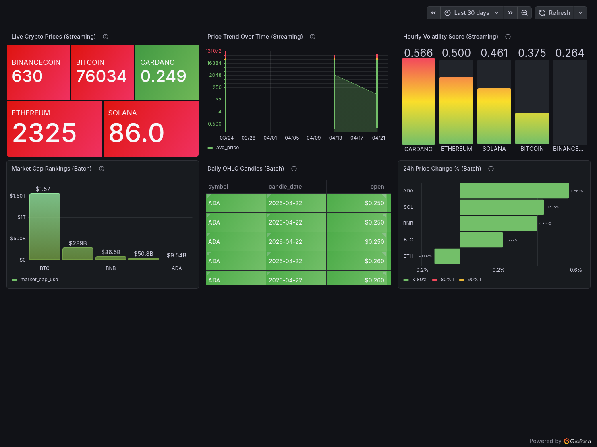
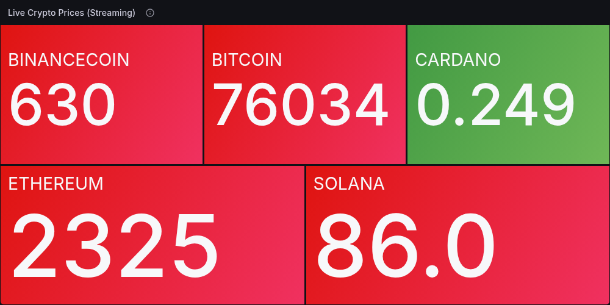
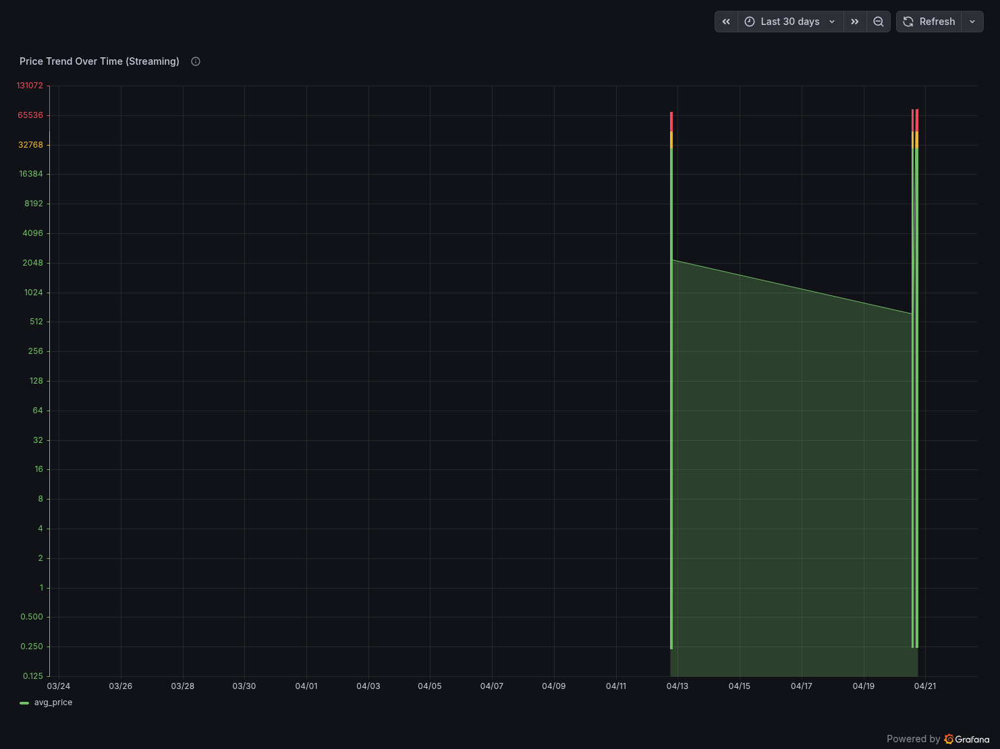
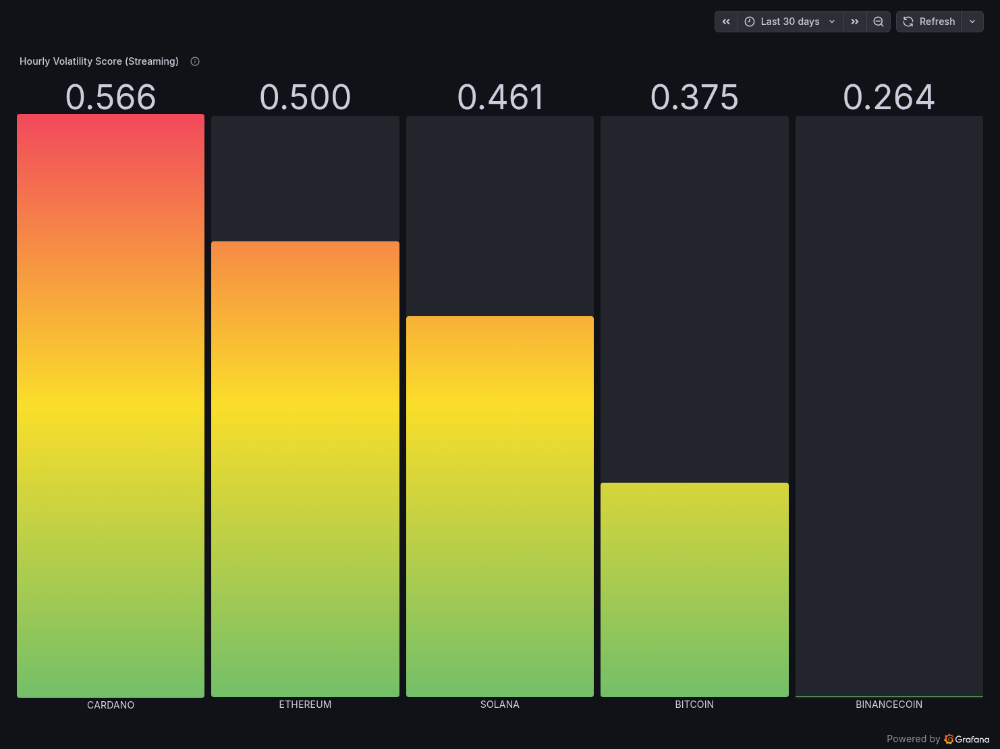
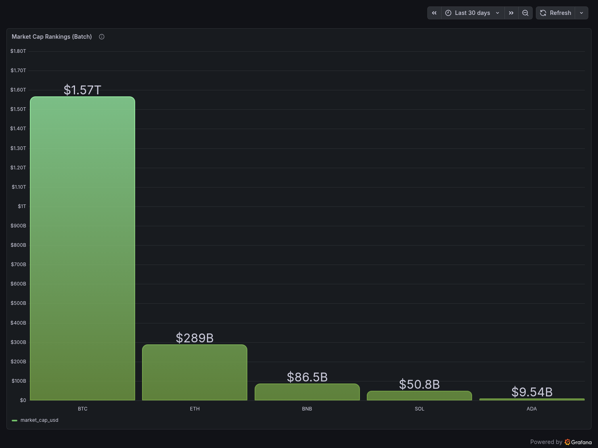
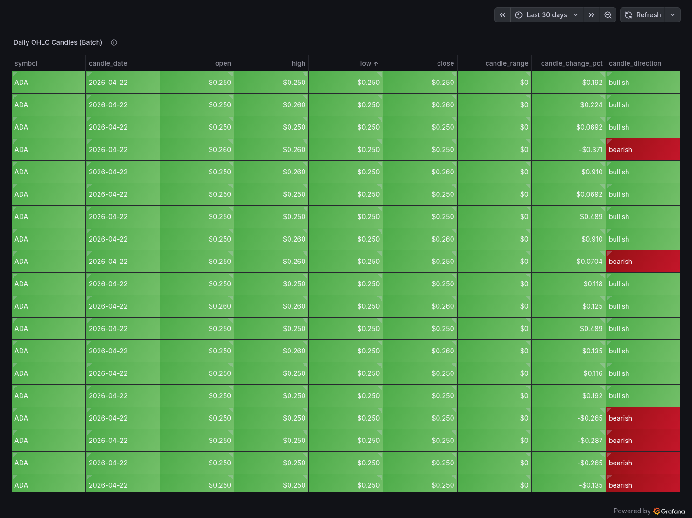
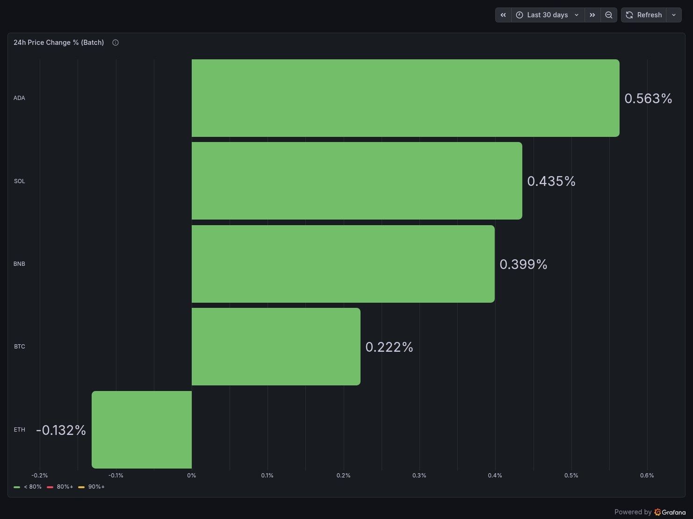

# CoinPulse — Real-Time Crypto Analytics Pipeline

A production-grade hybrid **streaming and batch** cryptocurrency analytics pipeline built on Google Cloud Platform, tracking BTC, ETH, SOL, BNB, and ADA in real time at near-zero infrastructure cost (~$0.01/month).

> **Live Dashboard:** [https://derrickryangiggs.grafana.net/public-dashboards/81560968e15140f08f65b52d78a4b252](https://derrickryangiggs.grafana.net/public-dashboards/81560968e15140f08f65b52d78a4b252)

---

## Table of Contents

- [Problem Description](#problem-description)
- [Solution Overview](#solution-overview)
- [Architecture](#architecture)
- [Tech Stack](#tech-stack)
- [Project Structure](#project-structure)
- [Cloud Infrastructure (Terraform / IaC)](#cloud-infrastructure-terraform--iac)
- [Data Ingestion](#data-ingestion)
  - [Streaming Lane](#streaming-lane)
  - [Batch Lane](#batch-lane)
- [Data Warehouse (BigQuery)](#data-warehouse-bigquery)
- [Transformations (dbt Cloud)](#transformations-dbt-cloud)
- [Dashboard (Grafana Cloud)](#dashboard-grafana-cloud)
- [Prerequisites](#prerequisites)
- [Reproduction Steps](#reproduction-steps)
- [Cost Breakdown](#cost-breakdown)
- [Daily Operations](#daily-operations)
- [Key Engineering Decisions](#key-engineering-decisions)

---

## Problem Description

Cryptocurrency markets generate enormous amounts of data every second. Traders, analysts, and researchers need to simultaneously track **real-time price movements** and understand **longer-term market context** — but these are two fundamentally different data problems:

**The streaming problem:** Tick-by-tick prices from exchanges require low-latency stream processing to compute meaningful aggregations like average price, intra-minute volatility, and price momentum. Raw ticks at this volume cannot be stored or queried directly in a warehouse at reasonable cost.

**The batch problem:** Market cap, rankings, and daily OHLC candlestick data changes slowly — once daily is sufficient — but needs to be joined with real-time data to give streaming metrics full context (e.g. "BTC's 30-second price spike is happening in a coin ranked #1 with $1.57T market cap, down 0.13% today").

**CoinPulse solves both problems** with a dual-lane pipeline architecture. The streaming lane ingests live Binance trade events, aggregates them with Apache Flink, and persists results to BigQuery. The batch lane fetches daily snapshots from CoinGecko via a fully orchestrated 7-task Airflow DAG. dbt Cloud joins both lanes into analytics-ready mart tables refreshed daily. Grafana Cloud provides a live, public, auto-refreshing dashboard — all at ~$0.01/month by keeping compute local and using GCP only for storage.

---

## Solution Overview

| Dimension | Detail |
|---|---|
| Assets tracked | Bitcoin, Ethereum, Solana, BNB, Cardano |
| Streaming source | Binance WebSocket (no API key required) |
| Batch source | CoinGecko Demo API (free, 10K calls/month) |
| Stream latency | ~1 minute (1-min tumbling event-time windows) |
| Batch schedule | Daily at 06:00 UTC (Airflow DAG) |
| dbt schedule | Daily at 07:00 UTC (dbt Cloud deploy job) |
| Infrastructure cost | ~$0.01/month |
| Dashboard | Public Grafana Cloud, 6 panels, auto-refresh 30s |

---

## Architecture

```
━━━━━━━━━━━━━━━━━━━━━━━━━━━━━━━━━━━━━━━━━━━━━━━━━━━━━━━━━━━━━━━
                     COINPULSE ARCHITECTURE
━━━━━━━━━━━━━━━━━━━━━━━━━━━━━━━━━━━━━━━━━━━━━━━━━━━━━━━━━━━━━━━

┌─────────────────────────────────────────────────────────────┐
│       INFRASTRUCTURE LAYER  (Terraform → GCP)               │
│  Project: coinpulse-2026        Region: us-central1         │
│  GCS Bucket: coinpulse-data-lake                            │
│  BQ: crypto_raw | crypto_staging | crypto_mart              │
│  Service Account: coinpulse-sa (BQ Editor + GCS Admin)      │
└─────────────────────────────────────────────────────────────┘

┌──────────────────────────┐   ┌───────────────────────────────┐
│      STREAMING LANE      │   │         BATCH LANE            │
│      (real-time)         │   │    (daily @ 06:00 UTC)        │
└──────────────────────────┘   └───────────────────────────────┘
         │                                   │
         ▼                                   ▼
Binance WebSocket                  CoinGecko Demo API
BTC/ETH/SOL/BNB/ADA                /coins/markets
~1 tick/second                     /coins/{id}/ohlc
         │                                   │
         ▼                                   ▼
Python Producer (Docker)           Airflow DAG (Docker)
websockets + confluent-kafka        7 tasks, 2 parallel branches
         │                                   │
         ▼                          T1→T2→T3→T4  T5→T6→T7
Redpanda Broker (Docker)                     │
topic: crypto-prices                         ▼
         │                          GCS Parquet files
         ▼                          /raw/coingecko/
PyFlink Job (Docker)                /raw/ohlc/
1-min tumbling windows                       │
avg/min/max/stddev/open/close                ▼
         │                          BQ Load Job (free)
         ▼                          crypto_raw.coingecko_ohlcv
GCS JSONL files                     crypto_raw.coingecko_ohlc_candles
/streaming/YYYY/MM/DD/HH/
         │
         ▼
BQ Load Job (free)
crypto_raw.stream_prices
Partitioned HOUR | Clustered: symbol

     ┌──────────────────────────────────────────────┐
     │   dbt Cloud  (scheduled daily @ 07:00 UTC)   │
     │   Staging views  →  Incremental mart tables  │
     └──────────────────────────────────────────────┘
                          │
                          ▼
     ┌──────────────────────────────────────────────┐
     │          Grafana Cloud Dashboard             │
     │   BigQuery plugin │ 6 panels │ Public URL    │
     └──────────────────────────────────────────────┘
```

---

## Tech Stack

| Layer | Tool | Version | Deployment |
|---|---|---|---|
| Infrastructure as Code | Terraform | >= 1.3.0 | Local CLI |
| Message Broker | Redpanda | v25.3.9 | Docker (local) |
| Stream Processor | PyFlink | 2.2.0 | Docker (local, custom image) |
| Workflow Orchestration | Apache Airflow | 2.9.2 | Docker Compose (local) |
| Object Storage | Google Cloud Storage | — | GCP (managed) |
| Data Warehouse | BigQuery | — | GCP (managed) |
| Transformations | dbt Cloud | 2.0.0 | Cloud (free developer plan) |
| Visualization | Grafana Cloud | — | Cloud (free forever tier) |
| Streaming Source | Binance WebSocket | — | External (no auth needed) |
| Batch Source | CoinGecko Demo API | v3 | External (free, 10K calls/month) |
| Airflow Metadata DB | PostgreSQL | 13 | Docker (local) |

---

## Project Structure

```
coinpulse/
├── terraform/
│   ├── main.tf               # GCP project, APIs, SA, GCS bucket, BQ tables
│   ├── variables.tf          # All config as variables — zero hardcoding
│   └── outputs.tf            # Project ID, bucket, datasets, SA email
│
├── streaming/
│   ├── producer/
│   │   ├── producer.py       # Binance WebSocket → Redpanda
│   │   ├── requirements.txt
│   │   └── Dockerfile
│   └── flink/
│       ├── flink_job.py      # Redpanda → PyFlink windows → GCS JSONL
│       ├── requirements.txt
│       └── Dockerfile        # pyflink-workshop:latest + google-cloud-storage
│
├── airflow/
│   ├── dags/
│   │   └── coingecko_batch.py   # 7-task DAG: fetch → parquet → GCS → BQ
│   └── docker-compose.airflow.yml
│
├── dbt/
│   ├── models/
│   │   ├── sources.yml
│   │   ├── staging/
│   │   │   ├── stg_stream_prices.sql
│   │   │   ├── stg_coingecko_markets.sql
│   │   │   └── stg_ohlc_candles.sql
│   │   └── marts/
│   │       ├── mart_crypto_prices.sql
│   │       └── mart_volatility.sql
│   └── dbt_project.yml
│
├── images/                   # Dashboard screenshots (referenced in README)
│   ├── dashboard_overview.png
│   ├── live_prices.png
│   ├── price_trend.png
│   ├── volatility_score.png
│   ├── market_cap_rankings.png
│   ├── ohlc_candles.png
│   ├── price_change_pct.png
│   └── dbt_run_history.png
│
├── secrets/
│   └── gcp-key.json          # Git-ignored. Place service account key here.
│
├── docker-compose.streaming.yml   # Redpanda + Producer + Flink cluster
├── .env                           # Single source of truth — all config here
├── .env.example                   # Template (safe to commit)
├── .gitignore
└── README.md
```

---

## Cloud Infrastructure (Terraform / IaC)

All GCP resources are provisioned via Terraform — nothing is created manually in the console. Running `terraform apply` creates:

- GCP project (`coinpulse-2026`) linked to billing account
- Enables APIs: BigQuery, BigQuery Storage, Cloud Storage, Cloud Resource Manager
- Service account `coinpulse-sa` with `bigquery.dataEditor`, `bigquery.jobUser`, and `storage.objectAdmin` IAM roles
- GCS bucket `coinpulse-data-lake` (us-central1, uniform access, 90-day lifecycle rule)
- BigQuery datasets: `crypto_raw`, `crypto_staging`, `crypto_mart`
- BigQuery tables with explicit schemas, partitioning, and clustering
- Service account key output (base64-encoded, decoded to `secrets/gcp-key.json`)

No values are hardcoded in `.tf` files — all configuration flows from `.env` via `TF_VAR_` prefixed environment variables.

---

## Data Ingestion

### Streaming Lane

This lane uses **Redpanda** (Kafka-compatible broker, no Zookeeper) and **Apache Flink 2.2.0 / PyFlink** for stream processing — a production-grade combination used in financial data engineering at scale.

**How it works:**

1. The Python Producer connects to the Binance WebSocket (`wss://stream.binance.com:9443/stream?streams=btcusdt@trade/ethusdt@trade/solusdt@trade/bnbusdt@trade/adausdt@trade`), parses each trade tick, and publishes JSON messages to the `crypto-prices` Redpanda topic via `confluent-kafka`.
2. The PyFlink Job consumes from Redpanda, keys the stream by coin symbol, and applies **1-minute tumbling event-time windows** with a 10-second late arrival watermark. Each completed window emits: `avg_price`, `min_price`, `max_price`, `price_stddev`, `open_price`, `close_price`, `record_count`, `window_start`, `window_end`.
3. The GCS Sink (implemented as a Flink `MapFunction`) writes each result as a JSONL file to `gs://coinpulse-data-lake/streaming/YYYY/MM/DD/HH/`.
4. A BigQuery Load Job (free tier) loads the JSONL files into `crypto_raw.stream_prices`.

### Batch Lane

The `coingecko_batch_etl` Airflow DAG runs two parallel branches at **06:00 UTC daily**, with retry logic (2 retries, 5-minute delay) on each task.

```
fetch_coingecko → transform_to_parquet → upload_to_gcs → load_to_bigquery
fetch_ohlc      → upload_ohlc_to_gcs   → load_ohlc_to_bigquery
```

**Markets branch:** Fetches current price, market cap, 24h volume, price change %, rank, and FDV from CoinGecko `/coins/markets`. Converts to Parquet (explicit typed schema, no autodetect), uploads to GCS, loads to `crypto_raw.coingecko_ohlcv`.

**OHLC branch:** Fetches 1-day candlestick arrays from CoinGecko `/coins/{id}/ohlc` for each of the 5 coins. Computes `candle_range`, `candle_change`, and `candle_direction`. Uploads to GCS, loads to `crypto_raw.coingecko_ohlc_candles`.

All environment variables are read inside function bodies at runtime (not at module import time) to prevent empty-string failures on scheduled runs after container restarts.

---

## Data Warehouse (BigQuery)

All BigQuery tables are partitioned and clustered to minimise query cost and maximise performance for the Grafana dashboard query patterns.

### `crypto_raw.stream_prices`
**Partitioned: HOUR on `event_timestamp` | Clustered: `symbol`**

Rationale: Dashboard queries always filter by time range and by specific coins. Hour-level partitioning means BQ scans only relevant hour partitions. Clustering by symbol means within each partition, rows for the same coin are co-located — `WHERE symbol = 'bitcoin'` becomes extremely cheap.

### `crypto_raw.coingecko_ohlcv`
**Clustered: `symbol`**

Rationale: This is a small table (5 rows/day). Day-level partitions would be near-empty and add no scan benefit. Clustering by symbol serves the primary query pattern (filter by coin) efficiently.

### `crypto_raw.coingecko_ohlc_candles`
**Clustered: `symbol`**

Rationale: Same as above — OHLC candles are fetched at 1-day granularity per coin. Symbol clustering serves per-coin candle queries on the dashboard.

---

## Transformations (dbt Cloud)

Transformations are defined entirely in **dbt Cloud** (free Developer plan), connected to this GitHub repository via the dbt Cloud GitHub integration.

A **scheduled dbt deploy job** named `coinpulse deploy job` runs daily at **07:00 UTC** — one hour after the Airflow batch DAG completes — ensuring mart models always reflect the latest data.


The deploy job has been running successfully on schedule since April 19, 2026, with each run completing in under 45 seconds.

### Staging Layer (`crypto_staging.*`) — Views

Materialised as BigQuery views. Zero storage cost.

- **`stg_stream_prices`** — Cleans and type-casts `stream_prices`. Filters null symbols and zero prices. Adds `event_date` and `symbol_upper` derived columns.
- **`stg_coingecko_markets`** — Uppercases symbols. Adds `market_cap_category` (large/mid/small/micro cap) derived from market cap value.
- **`stg_ohlc_candles`** — Casts `candle_time` to TIMESTAMP. Adds `candle_range`, `candle_change_pct`, and `candle_direction` (bullish/bearish).

### Mart Layer (`crypto_mart.*`) — Incremental Tables

Materialised as incremental BigQuery tables using `insert_overwrite` strategy.

- **`mart_crypto_prices`** — Joins streaming aggregations with latest daily market metadata. Partitioned HOUR on `event_timestamp`, clustered by `symbol`. Incremental filter scans only the last 2 hours of streaming data per run to minimise BQ costs.
- **`mart_volatility`** — Computes hourly volatility metrics combining streaming stddev and OHLC candle metrics into a `composite_volatility_score`. Partitioned HOUR on `window_hour`, clustered by `symbol`.

To run dbt manually from the dbt Cloud IDE:

```bash
dbt deps
dbt run --select staging
dbt run --select marts
dbt test
```

---

## Dashboard (Grafana Cloud)

**Public Dashboard URL:** [https://derrickryangiggs.grafana.net/public-dashboards/81560968e15140f08f65b52d78a4b252](https://derrickryangiggs.grafana.net/public-dashboards/81560968e15140f08f65b52d78a4b252)

The dashboard connects directly to BigQuery via Grafana Cloud's native BigQuery plugin (free on all tiers including Cloud Free). It contains **6 panels** across two data lanes with a 30-second auto-refresh.

### Dashboard Overview



---

### Panel 1 — Live Crypto Prices (Streaming)

Treemap showing real-time latest prices for all 5 assets from `crypto_raw.stream_prices`. Colour-coded green (up) / red (down) based on price direction relative to the previous window.



---

### Panel 2 — Price Trend Over Time (Streaming)

Time series chart showing `avg_price` per coin over the selected time range. Sourced from `crypto_raw.stream_prices`. The logarithmic Y-axis handles the large price spread between BTC (~$76K) and ADA (~$0.25).



---

### Panel 3 — Hourly Volatility Score (Streaming)

Bar chart showing the `composite_volatility_score` per coin from `crypto_mart.mart_volatility`. Cardano leads at 0.566, Binance Coin is lowest at 0.264. The gradient colour (green → red) encodes volatility magnitude.



---

### Panel 4 — Market Cap Rankings (Batch)

Bar chart of market capitalisation from the `coingecko_ohlcv` batch table. BTC dominates at $1.57T, followed by ETH at $289B, BNB at $86.5B, SOL at $50.8B, and ADA at $9.54B.



---

### Panel 5 — Daily OHLC Candles (Batch)

Table panel showing OHLC candlestick records from `crypto_raw.coingecko_ohlc_candles`, including derived `candle_change_pct` and `candle_direction`. Bearish rows highlighted in red.



---

### Panel 6 — 24h Price Change % (Batch)

Horizontal bar chart showing 24-hour price change percentage per coin from `coingecko_ohlcv`. ADA leads at +0.563%, ETH is the only negative at -0.132%.



---

## Prerequisites

- Ubuntu 20.04+ (tested on Ubuntu 25.10, 30GB RAM)
- Docker Engine >= 24.0 + Docker Compose v2
- Terraform >= 1.3.0
- gcloud CLI authenticated (`gcloud auth application-default login`)
- A GCP account with billing enabled
- Free CoinGecko Demo API key — [coingecko.com/en/api/pricing](https://www.coingecko.com/en/api/pricing)
- Free dbt Cloud account — [cloud.getdbt.com](https://cloud.getdbt.com)
- Free Grafana Cloud account — [grafana.com](https://grafana.com)

---

## Reproduction Steps

### 1. Clone the Repository

```bash
git clone https://github.com/Derrick-Ryan-Giggs/coinpulse.git
cd coinpulse
```

### 2. Configure Environment Variables

```bash
cp .env.example .env
# Edit .env and fill in your values (see template below)
```

`.env` template:

```bash
# GCP (Terraform reads these via TF_VAR_ prefix)
TF_VAR_gcp_project_id=coinpulse-2026
TF_VAR_gcp_billing_account=YOUR_BILLING_ACCOUNT_ID
TF_VAR_gcp_region=us-central1
TF_VAR_gcs_bucket_name=coinpulse-data-lake
TF_VAR_bq_dataset_raw=crypto_raw
TF_VAR_bq_dataset_staging=crypto_staging
TF_VAR_bq_dataset_mart=crypto_mart

# App
GCP_PROJECT_ID=coinpulse-2026
GCP_REGION=us-central1
GCS_BUCKET_NAME=coinpulse-data-lake
BQ_DATASET_RAW=crypto_raw
BQ_DATASET_STAGING=crypto_staging
BQ_DATASET_MART=crypto_mart
GOOGLE_APPLICATION_CREDENTIALS=/opt/gcp/key.json

# Streaming
KAFKA_BROKER=redpanda:9092
BINANCE_WS_URL=wss://stream.binance.com:9443/stream?streams=btcusdt@trade/ethusdt@trade/solusdt@trade/bnbusdt@trade/adausdt@trade

# Batch
COINGECKO_API_KEY=your_coingecko_demo_api_key_here

# Airflow
AIRFLOW_UID=1000
```

> **Security:** `.env` and `secrets/gcp-key.json` are in `.gitignore` and must never be committed.

### 3. Provision GCP Infrastructure

```bash
gcloud auth application-default login

export $(grep -v '^#' .env | xargs)

cd terraform
terraform init
terraform plan
terraform apply -auto-approve

# Save the service account key
terraform output -raw service_account_key | base64 --decode > ../secrets/gcp-key.json
cd ..
```

Terraform creates the GCP project, enables all required APIs, creates the service account with IAM roles, provisions the GCS bucket, and creates all BigQuery datasets and tables with correct schemas, partitioning, and clustering.

### 4. Start the Streaming Lane

```bash
export $(grep -v '^#' .env | xargs)

docker compose -f docker-compose.streaming.yml build
docker compose -f docker-compose.streaming.yml up -d

# Verify all containers are healthy
docker compose -f docker-compose.streaming.yml ps

# Verify messages flowing into Redpanda
docker exec coinpulse-redpanda rpk topic consume crypto-prices \
    --brokers localhost:9092 --num 5
```

### 5. Submit the Flink Job

Wait for the Flink cluster to be healthy (check `http://localhost:8081`), then:

```bash
docker exec coinpulse-flink-jobmanager \
    /opt/flink/bin/flink run \
    --python /opt/flink/usrlib/flink_job.py
```

The job runs indefinitely. Verify it is running:

```bash
curl -s http://localhost:8081/jobs | python3 -m json.tool
```

After ~1 minute, verify JSONL files are appearing in GCS:

```bash
docker exec coinpulse-flink-jobmanager bash -c "
/opt/pyflink/.venv/bin/python3 -c \"
from google.cloud import storage
from google.oauth2 import service_account
creds = service_account.Credentials.from_service_account_file('/opt/gcp/key.json')
client = storage.Client(project='coinpulse-2026', credentials=creds)
blobs = list(client.bucket('coinpulse-data-lake').list_blobs(prefix='streaming/'))
print(f'Files in GCS: {len(blobs)}')
for b in blobs[:5]: print(b.name)
\""
```

### 6. Start the Batch Lane

```bash
cd airflow
export $(grep -v '^#' /path/to/coinpulse/.env | xargs)

# Initialise Airflow DB and create admin user
docker compose -f docker-compose.airflow.yml up airflow-init

# Start the full Airflow stack
docker compose -f docker-compose.airflow.yml up -d \
    airflow-webserver airflow-scheduler postgres
```

Access the Airflow UI at `http://localhost:8080` (admin / admin).

Trigger an immediate run:

```bash
docker exec coinpulse-airflow-scheduler airflow dags trigger coingecko_batch_etl
```

All 7 tasks should complete successfully in approximately 3 minutes.

### 7. Run dbt Transformations

1. Log in to [dbt Cloud](https://cloud.getdbt.com)
2. Create a new project named **CoinPulse**, connect it to this GitHub repo
3. Configure the BigQuery connection:
   - Authentication: `service-account-json`
   - Project: `coinpulse-2026`
   - Dataset (dev): `dbt_dev`
   - Paste the contents of `secrets/gcp-key.json`
4. In the dbt Cloud IDE, run:

```bash
dbt deps
dbt run --select staging
dbt run --select marts
dbt test
```

5. Create a scheduled **Production environment** deploy job to run daily at 07:00 UTC with `dbt run` + `dbt test`.

### 8. View the Dashboard

The public Grafana Cloud dashboard is available at:

**[https://derrickryangiggs.grafana.net/public-dashboards/81560968e15140f08f65b52d78a4b252](https://derrickryangiggs.grafana.net/public-dashboards/81560968e15140f08f65b52d78a4b252)**

To set up your own:
1. Log in to Grafana Cloud → **Connections → Add new connection → Google BigQuery**
2. Click **Install** (one click, free on all tiers)
3. Configure with your service account JSON key and project `coinpulse-2026`
4. Import the dashboard JSON from `grafana/dashboard.json` (in this repo)

---

## Cost Breakdown

This pipeline is designed to run at effectively zero cloud cost by keeping all compute local and using only GCP's free storage and query tiers.

| Service | Usage | Monthly Cost |
|---|---|---|
| Redpanda | Local Docker | $0.00 |
| PyFlink | Local Docker | $0.00 |
| Apache Airflow | Local Docker | $0.00 |
| GCS | ~200MB Parquet + JSONL files | ~$0.01 |
| BigQuery | <1GB data, Load Jobs only (no Streaming Inserts) | ~$0.00 |
| dbt Cloud | Developer plan | $0.00 |
| Grafana Cloud | Free tier (BigQuery plugin included) | $0.00 |
| **Total** | | **~$0.01/month** |

**Key cost-saving decisions:**
- BigQuery **Load Jobs** instead of Streaming Insert API (which charges per row)
- Flink writes to **GCS JSONL** instead of directly to BigQuery
- All compute (Flink, Redpanda, Airflow) runs **locally in Docker**, not on managed cloud services

---

## Daily Operations

**Starting the pipeline after a reboot:**

```bash
# Load environment
export $(grep -v '^#' /path/to/coinpulse/.env | xargs)

# 1. Start streaming stack
cd /path/to/coinpulse
docker compose -f docker-compose.streaming.yml up -d

# 2. Submit Flink job (once jobmanager is healthy)
docker exec coinpulse-flink-jobmanager \
    /opt/flink/bin/flink run \
    --python /opt/flink/usrlib/flink_job.py

# 3. Start Airflow
cd airflow
docker compose -f docker-compose.airflow.yml up -d \
    airflow-webserver airflow-scheduler postgres

# 4. Optional: trigger batch DAG immediately
docker exec coinpulse-airflow-scheduler \
    airflow dags trigger coingecko_batch_etl
```

**Monitoring:**
- Flink UI: `http://localhost:8081`
- Airflow UI: `http://localhost:8080` (admin / admin)
- Grafana: [Public dashboard URL](https://derrickryangiggs.grafana.net/public-dashboards/81560968e15140f08f65b52d78a4b252)

**Stopping the pipeline:**

```bash
docker compose -f docker-compose.streaming.yml down
cd airflow && docker compose -f docker-compose.airflow.yml down
```

---

## Key Engineering Decisions

**Why Redpanda over Apache Kafka?** Redpanda is Kafka-API compatible but runs as a single binary without Zookeeper, making it significantly simpler to operate in Docker. It starts in seconds and uses less RAM — important when also running Flink and Airflow on the same machine.

**Why PyFlink 2.2.0 over 1.18.0?** The `pyflink-workshop:latest` image already on the machine contained Flink 2.2.0 with the Kafka connector JAR (`flink-sql-connector-kafka-4.0.1-2.0.jar`) pre-installed. Reusing it avoided a multi-GB download and long build. Google Cloud libraries were layered on top via a thin custom Dockerfile.

**Why GCS sink from Flink instead of direct BigQuery write?** BigQuery's Streaming Insert API charges per row. At real-time tick data volumes, that adds up. Writing to GCS as JSONL and using Load Jobs (free) maintains the same analytical freshness for minute-level queries at zero cost.

**Why dbt Cloud over dbt Core?** The project already runs Redpanda, Flink, Airflow, and PostgreSQL locally (~13GB RAM). Adding a dbt Core Docker container would push RAM higher for no functional gain. dbt Cloud keeps the transformation layer off the local machine, provides a managed scheduler, visual lineage graph, and test runner — all free on the developer plan.

**Why Grafana Cloud over Looker Studio?** Grafana supports 30-second auto-refresh, making it suitable for real-time streaming data. Looker Studio does not auto-refresh. The BigQuery plugin is available free on Grafana Cloud's free tier. CoinPulse's earlier projects already used Looker Studio, so Grafana demonstrates range across tooling.

**Why no hardcoded values anywhere?** All configuration lives in `.env`. Terraform reads via `TF_VAR_` prefix. Python reads via `os.environ` inside function bodies — not at module import time, which caused scheduled Airflow runs to fail when modules were reloaded after container restarts. Docker Compose passes them via `env_file` and `environment` directives.

**Why explicit BQ schemas instead of autodetect?** PyArrow (used by Pandas `.to_parquet()`) infers Python `datetime` objects as `TIMESTAMP` and strings as `STRING`, but these inferences conflict when BQ tables already exist from previous runs with different type interpretations. Defining explicit schemas in the DAG load config eliminates all schema mismatch errors permanently.